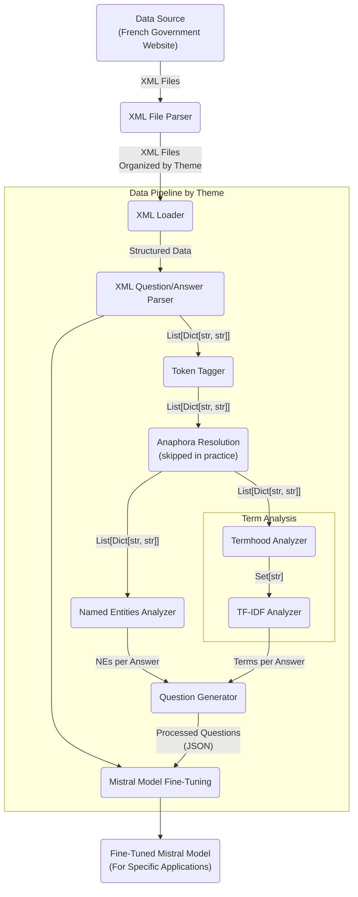
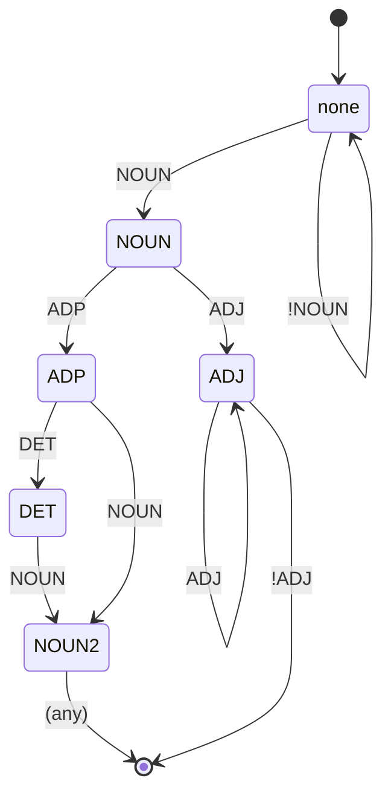

# NLP project

## Intro

This repository is for our team's final project of IMT Atlantique's Natural Language Processing and Text Mining course taught by Yannis Haralambous and Gábor Bella.

**Group Members:**

- Thaïs ARCHAUD
- Mathilde BERGER
- Sébastien DANCOISNE
- Yanice MOREAU
- Maxime PRADILLON

## Setup and Usage

> You will need to install all the dependencies detailed in `requirements.txt` using either `pip` or `conda`. If running `pip install -r requirements.txt` does not work, run `pip install` manually with each library in the list (omiting the version may help you avoid some issues for some reason). The `--user` option may be added if elevated privileges are required (typically when access rights are denied when pip attempts to install the wheels after downloading them).
>
> **Regarding the two `fr` models** (as listed near the start of the requirements file), they are submodels for spaCy--not standalone libraries. The correct command to download them individually (after spaCy) is: `python -m spacy download <model_name>` (with `<model_name>` being the name of the model (before the `@` character), with hyphens `-` replaced with underscores `_`--so for example, `fr-core-news-sm` would become `fr_core_news_sm`). Depending on the system/OS you are running, you may need to use `python3` and `pip3` instead of `python` and `pip`.

**Data Pipeline:** To parse XML files and generate outputs (parsed questions/answers under `data/results/<Topic>/output.json`), and then extract relevant terms for each answer (answer to list of terms mappings under `data/results/<Topic>/terms.json`), please run the [**`data_pipeline.py`**](src/data_pipeline.py) Python script. As mentioned, run either `python` or `python3` (depending on your particular case), followed by `src/data_pipeline.py` to achieve this and run the data generating pipeline. In summary, XML files from `data/themes` will be parsed, and the associated outputs will be placed under `data/results`. This may take a while, but there are `tqdm` progress bars along with console logging to keep track of progress.

> For a better understanding of the pipelines, please refer to the [appropriate section](#pipeline).

**AI Pipeline:** You can then try and load those mappings to generate questions to train the model. This uses a "seq-to-seq" transformer AI which utilizes attention to turn a **context paragraph** (i.e. an *answer*, in our case) with a specific **highlighted term** within (using `<hl>` tags) into a number of context-relevant questions. The questions generator script can be found [**here**](src/question_generator.py) and should be run AFTER the data pipeline. It can be used to load all `terms.json` files to produce a massive `train.csv` file as output (under `data/`), with all pairs of user questions (as generated for each **context**) and bot answers (the **term** associated with each question). It can then be fed to the LLM for fine-tuning (read further down below).

---

Speaking of which, to train and run the LLM itself, you need access to a repo in a [*Hugging Face*](https://huggingface.co/) account of your own. You can decide to attempt **fine-tuning** it [*locally*](#fine-tuning-the-model-locally) if you have enough RAM and a decent GPU, or you can try and see for [*online*](#fine-tuning-the-model-online) options (which may sometimes require payment).

### Fine-Tuning the Model Locally

If you wish to train the model **locally** on your own hardware, make sure you are using **Mac** or **Linux** and have [Anaconda](https://anaconda.org/) installed. If you are running **Windows**, you cannot train the model directly within the OS but you can run **WSL** and it should let you proceed. WSL-specific instructions to install Anaconda can be found [here](https://gist.github.com/kauffmanes/5e74916617f9993bc3479f401dfec7da). Be careful, you better have a capable GPU (an **Nvidia** graphics card is ideal for compatibility), with enough VRAM and RAM! (the CLI will give you feedback about these)

Once Anaconda is installed and the `conda` command can be used in your terminal, follow [**this tutorial**](https://github.com/huggingface/autotrain-advanced) (run the **second codeblock** worth of (conda-specific) commands from the README file). You should now have a Conda environment for AutoTrain with all the necessary dependencies installed.

> If you had Torch already and are experiencing issues with GPU recognition, you may want to make sure your GPU is properly recognized by PyTorch. Open any Python shell (or script), then `import torch`, and finally display the result of `torch.cuda.is_available()`. It should return `True`. If that is not the case, uninstall Torch using either `pip` or `conda` and then reinstall it cleanly (penultimate command listed in the tutorial linked above). You may also want to run `accelerate config` and follow the steps prior to training.

Also, make sure you generate a *Hugging Face* **token** with WRITE access. You can now finally initiate the training process. Navigate to a **directory** where the `train.csv` file is stored, and run the following command in your terminal: (the section inside square brackets `[]` is optional, you can try with and without depending on how well it works for you--you should generally feel free to tweak and play around with most parameters depending on what works best for your needs!)

```bash
autotrain llm --train --project-name <project_name_here> --model bigscience/bloom-1b1 --data-path . --use-peft --train-batch-size 12 [--trainer sft --push-to-hub] --repo-id <repository_id_here> --token <hf_write_token_there>
```

> The file located at [`data/formatted_data.csv`](data/formatted_data.csv) is an example of a valid `train.csv` format-wise (and can be used for basic fine-tuning without even running the data pipeline), but its bot answers are complete sentences whereas the proposed solution here is to only have terms, as described above.

The trained model should then appear in the *Hugging Face* repo you specified. No need to create a repo manually online prior to each attempt, just change the repo ID and project name every time in the command line and the repo will be created automatically on *Hugging Face*!

### Fine-Tuning the Model Online

You can use [this](https://colab.research.google.com/drive/1oV5wBvlWburCDaapuBIqgCFfk6x7g_xw?usp=share_link) link to a **Google Colab** Jupyter Notebook which you can use to train an LLM of your choice. You can keep the basic one as used in the demo if you just want to test the chatbot somewhat quickly!

Answer times may however be rather slow (~2mins per prompt).

> Google provides you with T4 hardware but it may be a limiting factor RAM-wise when attempting to run any of the larger models that may be more appropriate for French. You would then have to pay, so it would be recommended to just attempt doing it [locally](#fine-tuning-the-model-locally) instead, if you really want to get a final model.

## Conception & Sources

- dataset ->
    particulier : vosdroits-latest.zip
- Parser : <https://python.doctor/page-beautifulsoup-html-parser-python-library-xml>
- TDIFD : <https://programminghistorian.org/fr/lecons/analyse-de-documents-avec-tfidf>, <https://scikit-learn.org/stable/modules/generated/sklearn.feature_extraction.text.TfidfVectorizer.html>
- NER : <https://spacy.io/api/entityrecognizer>
- Bert : <https://medium.com/featurepreneur/question-generator-d21265c0648f>

## TO DO

- [x] XML File Parser
- [x] Data Pipeline
  - [x] XML Loader
  - [x] XML Q&A Parser
  - [x] Anaphoria Resolution
  - [x] Named Entities Analyzer
  - [x] Termhood Analyzer
  - [x] TFIDF Analyzer
- [x] Question Generator
- [ ] Fine Tuning Mistral Model
- [ ] Fine Tuned Mistral Model

## Pipeline

Our pipeline for data processing and then LLM training is as detailed below:



### Data Pipeline Description

1. Data Source: Originates from an external source, specifically XML files hosted on a French government website, ensuring relevance and authority.
2. XML File Parser: Organizes XML files into distinct folders based on thematic categorization, streamlining subsequent analytical processes.
3. XML Loader: Efficiently loads XML data from files within theme-specific folders, preparing the data for advanced parsing and analysis.
4. XML Question/Answer Parser: Parses structured data from the XML files, focusing on extracting valuable question-and-answer pairs for further analysis.
5. Anaphora Resolution: Disambiguates the question/answer json.
6. Termhood Analyzer: Identifies and extracts significant terms from the parsed data, employing criteria to determine their relevance and importance within the context.
7. Named Entities Analyzer: Focuses on extracting named entities from the data, crucial for understanding the specifics of the content and enhancing question generation.
8. TF-IDF Analyzer: Within the term analysis subgraph, this component applies Term Frequency-Inverse Document Frequency analysis to evaluate and rank the importance of terms.
9. Question Generator: Utilizes the outputs from the named entities analyzer, the general XML parser, and the TF-IDF analyzer to generate structured questions, enriching the dataset.
10. Mistral Model Fine-Tuning: Processes the enriched and structured questions using a BERT model, specifically fine-tuning the model to adapt to the specific characteristics of the data.
11. Fine-Tuned Mistral Model: The outcome is a model intricately adjusted for specific applications, leveraging the processed and analyzed data to perform tasks with higher accuracy and relevance.

This comprehensive overview not only delineates the pipeline's stages but also emphasizes the methodical approach to refining and leveraging data for specialized applications, particularly in natural language processing and question generation tasks

### Termhood State Machine

In the [`termhood_analyzer.py`](src/termhood_analyzer.py) script, prior to calculating the C-value for termhood, words are labelled with POS tags in the corpus. To identify potential candidate terms, we use the patterns as suggested in the [fourth lab](https://moodle.imt-atlantique.fr/pluginfile.php/34041/mod_resource/content/5/TP_TLFT_Irma.pdf) (about **Corpus Preparation**): `NC ADJ+` or `NC P DET? NC`. This works well enough for French, but since we are using spaCy's terminology, it must be translated to: `NOUN ADJ+` or `NOUN ADP DET+ NOUN` (with `P`, now `ADP`, being prepositions).

A **deterministic finite-state machine** (automaton) is used to parse through POS tags and identify such potential terms. Its logic is as follows:



> In *any* of these states, the state machine's result/success value is **undetermined** (i.e. None). When transitioning into the *terminal node*, the automaton becomes **successful** (i.e. True). When receiving a token with *no applicable transitions* given the current state, the automaton becomes **failed** (i.e. False).

In the implementation, when transitioning to *any* state *other* than "`none`", the token (word) used for that transition is appended to a **buffer** (to be returned later in case of a success).

Whenever a new token causes the automaton to become either **successful** or **failed**, the state machine gets reset. A new one is created and is fed that last token as a first input. In the instance of a **success**, specifically, the value of the **buffer** is retrieved prior to starting over, and it is added as a new candidate (i.e. potential term).

## Final Trained Model

Here is the code we used to fine tune our model on [Google Colab](https://colab.research.google.com/drive/1oV5wBvlWburCDaapuBIqgCFfk6x7g_xw?usp=sharing).

To test out the model we fine tuned, check out [this Google Colab file](https://colab.research.google.com/drive/1k7CeuOamS70afdFUayrSA-hA10eAmLrP?usp=share_link).

## Project Requirements

- Use the Rasa open-source framework (not mandatory but recommended).
- Do not stop at the default features of Rasa, use the techniques/principles that you will learn about:
  - at least one knowledge-driven technique from: ontologies, logical reasoning, wordnets, synonyms;
  - at least one learning-driven technique: frequentist methods, statistical ML, deep learning;
  - at least one grammar-driven technique: syntactic parsing, regular expressions, lemmatisation, morph. analysis.
- Work in groups of about five people.
- A five-person team can divide up the work as follows (example):

    1. overall Rasa pipeline setup, component integration, and testing;
    2. design and implementation of dialogue logic, intents, NLU, stories, etc.;
    3. design and implementation of the knowledge-based component(s);
    4. design and implementation of the learning-based component(s);
    5. design and implementation of the grammar-based component(s).

- Present your results at the end of the project in a ~15-minute presentation.
- You will be expected to present and justify your technological choices.
- You will not be penalised for an imperfect bot implementation, but you will be penalised
    for theoretically misguided design choices.
- Please do not implement an intentionally racist, misogynistic, etc. bot.
