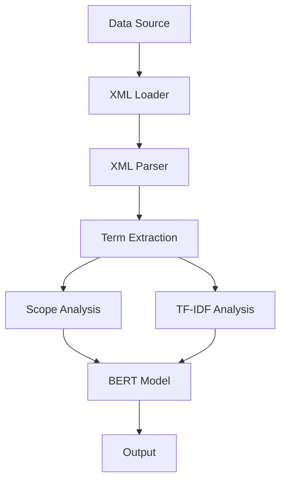

# NLP project

## Conception

- dataset ->
    particulier : vosdroits-latest.zip
    pro: vosdroits-latest.zip

- scrapping, intro, main paragraph, question and answer, … : <https://python.doctor/page-beautifulsoup-html-parser-python-library-xml>
- TDIFD : <https://programminghistorian.org/fr/lecons/analyse-de-documents-avec-tfidf>
- Bert : <https://medium.com/featurepreneur/question-generator-d21265c0648f>

## Pipeline

### Data Pipeline Flowchart

This flowchart represents the workflow of a data pipeline consisting of several stages:

1. Data Source: Data is sourced from an external source.
2. XML Loader: The XML Loader component loads the XML data.
3. XML Parser: The XML Parser component processes the XML data.
4. Term Extraction: Extracts terms from the parsed data.
5. Scope Analysis: Performs analysis on the extracted terms to determine their scope.
6. TF-IDF Analysis: Analyzes the terms using Term Frequency-Inverse Document Frequency (TF-IDF).
7. BERT Model: Utilizes a BERT (Bidirectional Encoder Representations from Transformers) model to further process the data.
8. Output: The final processed data is outputted.

Each stage in the pipeline performs specific tasks to transform and analyze the data, ultimately leading to the generation of useful insights or outputs.

## Project Requirements

- Use the Rasa open-source framework (not mandatory but recommended).
- Do not stop at the default features of Rasa, use the techniques/principles that you will learn about:
  - at least one knowledge-driven technique from: ontologies, logical reasoning, wordnets, synonyms;
  - at least one learning-driven technique: frequentist methods, statistical ML, deep learning;
  - at least one grammar-driven technique: syntactic parsing, regular expressions, lemmatisation, morph. analysis.
- Work in groups of about five people.
- A five-person team can divide up the work as follows (example):

    1. overall Rasa pipeline setup, component integration, and testing;
    2. design and implementation of dialogue logic, intents, NLU, stories, etc.;
    3. design and implementation of the knowledge-based component(s);
    4. design and implementation of the learning-based component(s);
    5. design and implementation of the grammar-based component(s).

- Present your results at the end of the project in a ~15-minute presentation.
- You will be expected to present and justify your technological choices.
- You will not be penalised for an imperfect bot implementation, but you will be penalised
    for theoretically misguided design choices.
- Please do not implement an intentionally racist, misogynistic, etc. bot.
