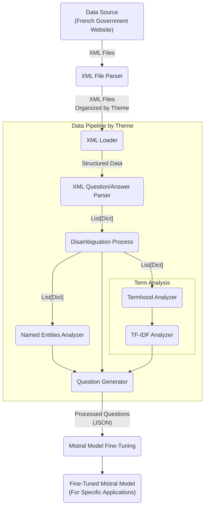

# NLP project

## Intro

This repository is for our team's final project of IMT Atlantique's Natural Language Processing and Text Mining course taught by Yannis Haralambous and Gábor Bella.

## Conception & Sources

- dataset ->
    particulier : vosdroits-latest.zip
    pro: vosdroits-latest.zip

- Parser : <https://python.doctor/page-beautifulsoup-html-parser-python-library-xml>
- TDIFD : <https://programminghistorian.org/fr/lecons/analyse-de-documents-avec-tfidf>, <https://scikit-learn.org/stable/modules/generated/sklearn.feature_extraction.text.TfidfVectorizer.html>
- NER : <https://spacy.io/api/entityrecognizer>
- Bert : <https://medium.com/featurepreneur/question-generator-d21265c0648f>

## TO DO

- [x] XML File Parser
- [ ] Data Pipeline
  - [x] XML Loader
  - [x] XML Q&A Parser
  - [ ] Disambiguation Process
  - [x] Named Entities Analyzer
  - [ ] Termhood Analyzer
  - [x] TFIDF Analyzer
- [ ] Question Generator
- [ ] Fine Tuning Mistral Model
- [ ] Fine Tuned Mistral Model

## Pipeline

### Data Pipeline Description

1. Data Source: Originates from an external source, specifically XML files hosted on a French government website, ensuring relevance and authority.
2. XML File Parser: Organizes XML files into distinct folders based on thematic categorization, streamlining subsequent analytical processes.
3. XML Loader: Efficiently loads XML data from files within theme-specific folders, preparing the data for advanced parsing and analysis.
4. XML Question/Answer Parser: Parses structured data from the XML files, focusing on extracting valuable question-and-answer pairs for further analysis.
5. Disambiguation Process: Disambiguates the question/answer json.
6. Termhood Analyzer: Identifies and extracts significant terms from the parsed data, employing criteria to determine their relevance and importance within the context.
7. Named Entities Analyzer: Focuses on extracting named entities from the data, crucial for understanding the specifics of the content and enhancing question generation.
8. TF-IDF Analyzer: Within the term analysis subgraph, this component applies Term Frequency-Inverse Document Frequency analysis to evaluate and rank the importance of terms.
9. Question Generator: Utilizes the outputs from the named entities analyzer, the general XML parser, and the TF-IDF analyzer to generate structured questions, enriching the dataset.
10. Mistral Model Fine-Tuning: Processes the enriched and structured questions using a BERT model, specifically fine-tuning the model to adapt to the specific characteristics of the data.
11. Fine-Tuned Mistral Model: The outcome is a model intricately adjusted for specific applications, leveraging the processed and analyzed data to perform tasks with higher accuracy and relevance.

This comprehensive overview not only delineates the pipeline's stages but also emphasizes the methodical approach to refining and leveraging data for specialized applications, particularly in natural language processing and question generation tasks

## Project Requirements

- Use the Rasa open-source framework (not mandatory but recommended).
- Do not stop at the default features of Rasa, use the techniques/principles that you will learn about:
  - at least one knowledge-driven technique from: ontologies, logical reasoning, wordnets, synonyms;
  - at least one learning-driven technique: frequentist methods, statistical ML, deep learning;
  - at least one grammar-driven technique: syntactic parsing, regular expressions, lemmatisation, morph. analysis.
- Work in groups of about five people.
- A five-person team can divide up the work as follows (example):

    1. overall Rasa pipeline setup, component integration, and testing;
    2. design and implementation of dialogue logic, intents, NLU, stories, etc.;
    3. design and implementation of the knowledge-based component(s);
    4. design and implementation of the learning-based component(s);
    5. design and implementation of the grammar-based component(s).

- Present your results at the end of the project in a ~15-minute presentation.
- You will be expected to present and justify your technological choices.
- You will not be penalised for an imperfect bot implementation, but you will be penalised
    for theoretically misguided design choices.
- Please do not implement an intentionally racist, misogynistic, etc. bot.
